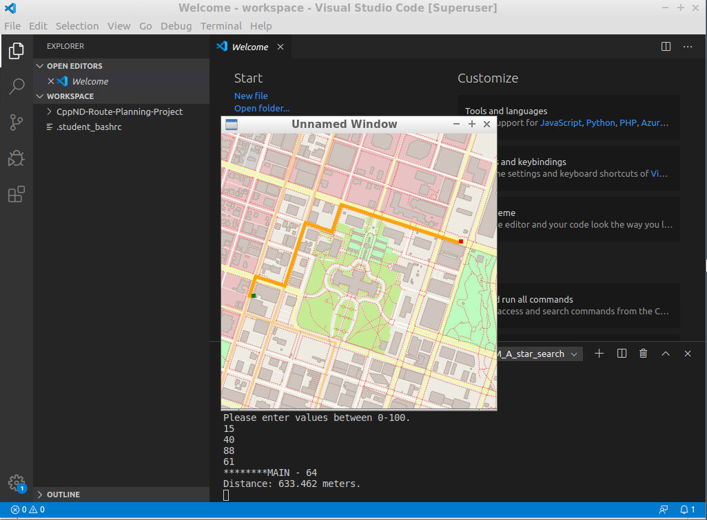

The Route Planner app, was made as part of Udacity's [C++ Nanodegree Program](https://www.udacity.com/course/c-plus-plus-nanodegree--nd213). The Route Planner allows users to search for the shortest path between two points on a map, using real map data from the OpenStreeMap project. 
The path searching is made by using the A* search algorithm and the user predefines the start and finish points by using x and y coordinates. 
The project extends the code from a [map rendering demo example](https://github.com/cpp-io2d/P0267_RefImpl/tree/master/P0267_RefImpl/Samples/maps) in the Github
for the IO2D 2D Graphics rendering library in order to display the path on the map.


## Cloning

When cloning this project, be sure to use the `--recurse-submodules` flag. Using HTTPS:
```
git clone https://Vatsilidis_Lampros@bitbucket.org/Vatsilidis_Lampros/openstreetmap_route_planner.git --recurse-submodules
```


## Dependencies for Running Locally
* cmake >= 3.11.3
  * All OSes: [click here for installation instructions](https://cmake.org/install/)
* make >= 4.1 (Linux, Mac), 3.81 (Windows)
  * Linux: make is installed by default on most Linux distros
  * Mac: [install Xcode command line tools to get make](https://developer.apple.com/xcode/features/)
  * Windows: [Click here for installation instructions](http://gnuwin32.sourceforge.net/packages/make.htm)
* gcc/g++ >= 7.4.0
  * Linux: gcc / g++ is installed by default on most Linux distros
  * Mac: same instructions as make - [install Xcode command line tools](https://developer.apple.com/xcode/features/)
  * Windows: recommend using [MinGW](http://www.mingw.org/)
* IO2D
  * Installation instructions for all operating systems can be found [here](https://github.com/cpp-io2d/P0267_RefImpl/blob/master/BUILDING.md)
  * This library must be built in a place where CMake `find_package` will be able to find it

## Compiling and Running

### Compiling
To compile the project, first, create a `build` directory and change to that directory:
```
mkdir build && cd build
```
From within the `build` directory, then run `cmake` and `make` as follows:
```
cmake ..
make
```
### Running
The executable will be placed in the `build` directory. From within `build`, you can run the project as follows:
```
./OSM_A_star_search
```
Or to specify a map file:
```
./OSM_A_star_search -f ../<your_osm_file.osm>
```
The map file should be exported from the [OpenStreetMap](https://www.openstreetmap.org/) website.

## Testing

The testing executable is also placed in the `build` directory. From within `build`, you can run the unit tests as follows:
```
./test
```

## Credits
### Used resources
* [A map rendering example](https://github.com/cpp-io2d/P0267_RefImpl/tree/master/P0267_RefImpl/Samples/maps)	
* [OpenStreetMap](https://wiki.openstreetmap.org/wiki/Main_Page)

### Contributors
* [Lampros Vatsilidis](https://www.linkedin.com/in/lampros-vatsilidis-5666ba128/)
* [Udacity C++ Nanodegree Program](https://www.udacity.com/course/c-plus-plus-nanodegree--nd213) 
